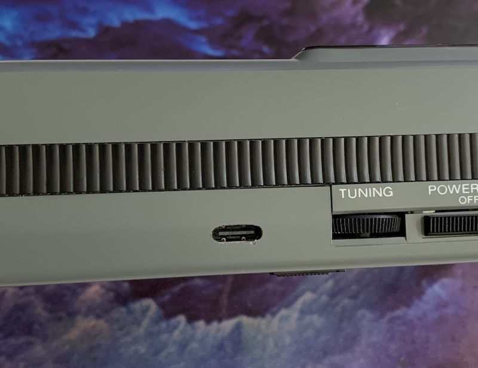

# Sony-Scopeman

Hardware Design files of a replacement mainboard for the Sony Watchman FD-10A. This turns it into a bluetooth and Wi-Fi-enabled vector display.

# Features
There are two modes which can be selected via the power switch:

* In "Audio" mode, the ESP32 acts as a bluetooth speaker. Play back audio files from your smartphone or laptop to hear and see the soundwaves. You can change the size by adjusting the playback volume

    [Audio Demo](https://twitter.com/FauthNiklas/status/1337467949318279170)

* In "Video" mode, the ESP32 renders the result of the Lorenz Attractor equation. You can change the simulation speed using the "Tune" knob.

    [Video Demo](https://twitter.com/FauthNiklas/status/1339650704584171522)

# Instructions

You'll need:

* Sony Watchman Model FD-10A
* Pre-assembled replacemend mainboard (eg. from JLCPCB assembly)
* Two 803040 (1000mAh) Lipo batteries with JST-PH 2.0mm connector

Open the Sony Watchman and unscrew the original mainboard. Make sure to keep all the screws in a safe place.

Unsolder all wires from the mainboard.

Unsolder (and unscrew) these components from the mainboard. We'll need them for our replacement.

Your trimmer pots might also be a different style, but check that they are the same 5k ohm value ("502").

Install all unsoldered components on the replacement mainboard.

Unsolder the speaker cables (black and white) from the flyback PCB. Solder them to the replacement PCB (take care of polarity. White is closer to the ESP32).
Remove all other cables from the flyback PCB except for blue, yellow, black and purple.

Your speaker wires might not be black and white, but both black.  There is a polarity of the speaker, and the positive (+) was marked with red paint/glyptol.  You might also have to extend your speaker wires.

Solder the blue (flyback signal) and yellow (blanking) to the new mainboard.
Do the same for purple (supply) and black (GND).

Next, connect the deflection coil wires (purple, white, red and blue). 

Here are more pictures of the assembled unit.
:mag: CLICK FOR A LARGER IMAGE!

:pencil2: If you want to slowly bring up your board and not let the magic smoke out, here are some things you can do:

- Use a current limited power supply and make a cable that plugs into the JST2.0 connector.  Set your power supply to 4V at 500mA.
- When the device normally powers on it draws about 300mA.  If it draws 500mA you probably have a short circuit somewhere.
- Check the +3.3V output (it should be about +3.3V)
- Check the -3.3V output (it should be about -3.7V)
- :warning: Check the FLYBACK output, it should be toggling at 16kHz @ 40% duty cycle.  If it's continuously LOW, it will make the power supply draw infinite amounts of current.  It should be pulled up to +3.3V when the ESP32 is reset/programming via R50.

You'll proabably want to play with it for a while and make sure everything is working well before moving on to the final steps.

You can now plug in the batteries (make sure the watchman is turned off) and screw the mainboard back in place. You need two screws for this (mind the arrows on the back of the PCB).

Now you can add a slothole to the lower half of the case for the USB type C jack. You also need to brake away some plastics to make space for the new batteries. No worries, if done correctly this won't be visible from the outside and the battery cover will still close.

Something really handy for these mods is the [Dremel 1/16" ballnose cutter (#109)](https://www.amazon.com/Dremel-109-Engraving-Cutter-16-inch/dp/B0006N72X4).  I got mine in an [11 piece Carving/Engraving Kit](https://www.amazon.com/Dremel-729-01-Engraving-Accessories-11-Piece/dp/B09FP387V2).  This is also really good for the USB-C cut-out.

That's it! Before you screw the watchman back together and store the batteries behind the cover, you may want to adjust the two potentiometers on the mainboard to center the image. But first you need to flash the firmware. Turn on the watchman and connect it via USB. You can then flash the ESP32 using the Arduino IDE (make sure to select "Board: ESP Wrover Module").

You might also need to readjust the focus. This can be done from outside using the original focus knob (hidden behind a small hole at the side).

# Credits

Deflection coil drivers inspired by http://www.e-basteln.de/file/asteroids/Vectrex_XY_Driver.pdf

A2DP Arduino lib for ESP32: https://github.com/pschatzmann/ESP32-A2DP

# Ordering

See the [BOM README.md](hardware/bom-vectorboy-v1.3/README.md)

:warning: **NOTE: Be sure to order the PCB thinner than standard, 0.040" (1.0mm) should be good.**  If you end up ordering as 0.062" (1.6mm), [you will have to make a bunch of modifications, but it can be done.](hardware/bom-vectorboy-v1.3/thick-pcb-mods.md)
