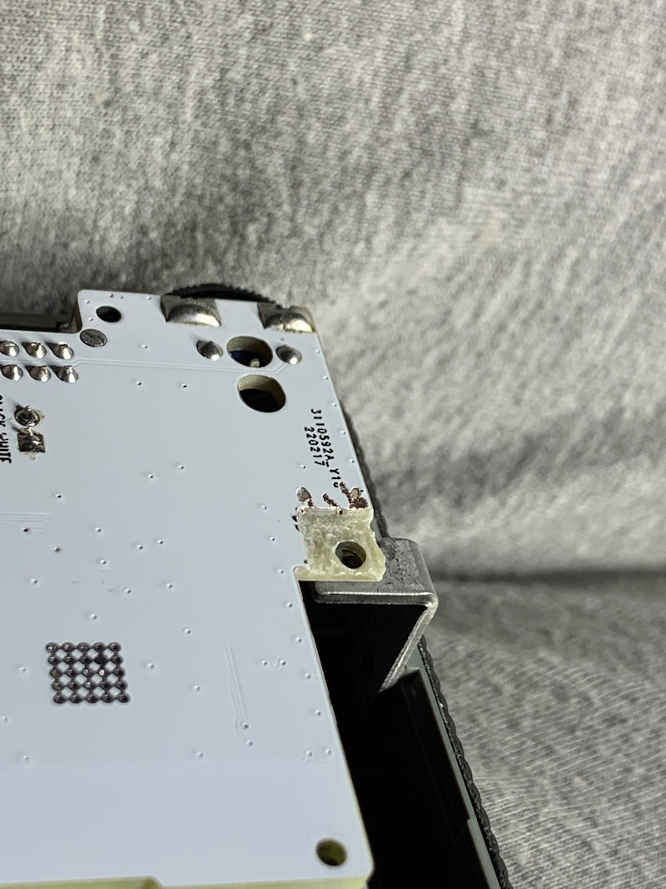

# Thick PCB Mods

**NOTE: These are the modifications required if you ended up ordering the PCB as a standard size 0.0625" (1.6mm).  If you have a thinner PCB 0.040" (1.0mm) you won't require these mods.**

This little tab on the volume knob probably won't fit all of the way through the PCB because it is thicker than the original.  You can trim the hook part off.

You will have to recess this screw to get enough of the threads to engage.

You will have to recess the area of the PCB that the antenna rests on.  This is also critical to get enough threads to engage and pull the enclosure together tightly.

The case back bosses need to have 1.0mm of material removed from them.  This is what they look like before modification (sorry I forgot to take a picture after modding... I did this on my CNC machine, but could easily be done with a dremel tool)

Something really handy for these mods is the [Dremel 1/16" ballnose cutter (#109)](https://www.amazon.com/Dremel-109-Engraving-Cutter-16-inch/dp/B0006N72X4).  I got mine in an [11 piece Carving/Engraving Kit](https://www.amazon.com/Dremel-729-01-Engraving-Accessories-11-Piece/dp/B09FP387V2).
